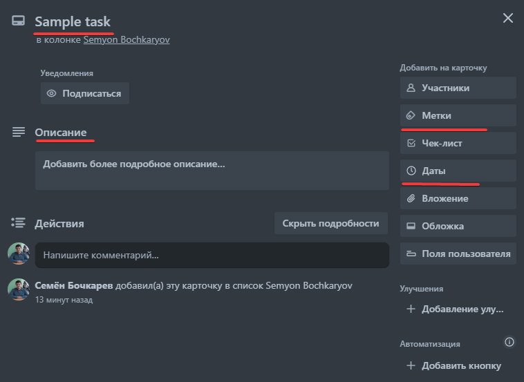

# Отчёт по лабораторной работе 4

## Цель работы

Целью данной работы является изучение тестового дизайна на примере составления и минимизации количества тестов для веб-приложения Trello.

## Описание эквивалентных классов

Рассмотрим форму задачи в Trello, упростив её до четырёх базовых полей, исходя из предположения, что доской пользуется один человек.

1. Название (обязательное поле)
2. Описание (необязательное поле)
3. Даты (необязательное поле)
4. Метки (список меток, необязательное поле)

### Эквивалентные классы

1. Название
   * EC1: Поле заполнено корректным названием (позитивный тест)
   * EC2: Поле не заполнено (негативный тест)
   * EC3: Поле заполнено недопустимыми символами (негативный тест)
2. Описание
   * EC4: Поле заполнено корректным описанием (позитивный тест)
   * EC5: Поле не заполнено (позитивный тест)
   * EC6: Поле заполнено недопустимыми символами (негативный тест)
3. Даты
   * EC7: Поле заполнено корректной датой (позитивный тест)
   * EC8: Поле не заполнено (позитивный тест)
   * EC9: Поле заполнено некорректной датой (негативный тест)
4. Метки
   * EC10: Поле заполнено корректными метками (позитивный тест)
   * EC11: Поле не заполнено (позитивный тест)
   * EC12: Поле заполнено некорректными метками (негативный тест)

### Расчёт количества тестов

Для минимизации количества тестов используем технику парного тестирования. Эта техника позволяет сократить количество тестов, сохраняя при этом покрытие всех возможных пар значений.

Однако для простоты и наглядности рассмотрим полный крестовый продукт эквивалентных классов:

1. Название задачи: EC1, EC2, EC3
2. Описание задачи: EC4, EC5, EC6
3. Дата выполнения: EC7, EC8, EC9
4. Метки: EC10, EC11, EC12

Общее количество тестов в полном крестовом продукте будет: 3×3×3×3=3^4=**81**.

### Пример теста

Возьмём следующий набор тестов: EC1, EC4, EC7, EC10.

Из него получается следующий тест-кейс:

1. Поле "Название" заполнено корректным названием.
2. Поле "Описание" заполнено корректным описанием.
3. Поле "Даты" заполнено корректной датой.
4. Поле "Метки" заполнено корректными метками.

## Выводы

Техника парного тестирования позволяет рассчитать минимальное количество тестов, необходимых для полного покрытия тестами сегмента программы. Это позволяет уже на этапе проектирования определить список потенциальных эквивалентных классов (так, не имеет смысла тестировать разные названия в рамках задачи; на название нет ограничений, кроме недопустимых символов, поэтому любые названия будут в рамках одного эквивалентного класса, отсутствие названия - в рамках другого, а использование недопустимых символов - к третьему).

Значение тестов может показаться огромным, но это гарантирует полное покрытие всех возможных случаев.
