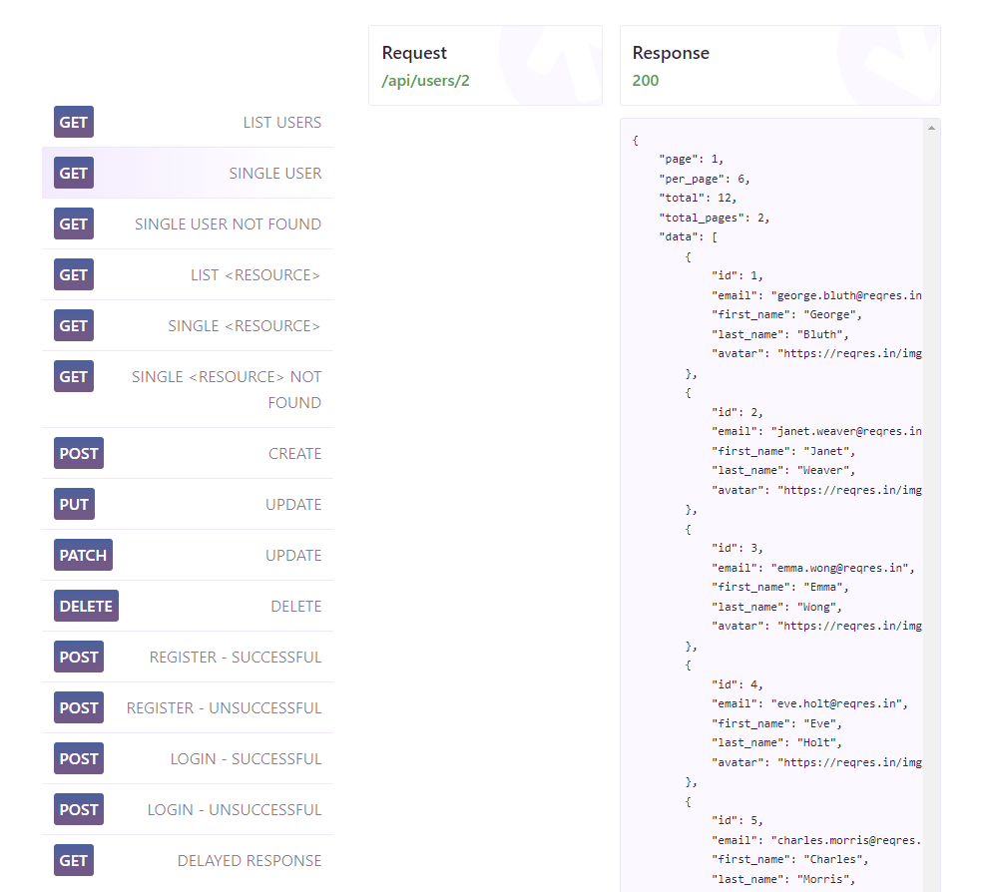

# Отчёт по лабораторной работе 6

## Цель работы

Целью работы является разработка автотестов для некоего веб-приложения с целью его детального тестирования. В качестве веб-приложения был выбран API-сервис reqres.in, который как раз и предназначен для проверки различного рода автотестов. Данный сервис предоставляет 12 API-эндпоинтов, эмулирующих регистрацию, авторизацию и взаимодействие со списком пользователей в типичном веб-приложении. Чтобы посмотреть список доступных эндпоинтов, достаточно перейти по ссылке https://reqres.in и выбрать любой эндпоинт из списка.



## Ограничения на автоматическое тестирование

Чтобы немного усложнить задачу и приблизить её к реальным условиям, мы будем использовать только стандартные библиотеки из поставки Python. Такое ограничение может показаться бессмысленным при тестировании на обычном ПК, однако существуют ситуации, где при тестировании невозможно установить сторонние библиотеки. К примеру, с такими ограничениями автор сталкивался на кластере - при запуске кода на кластере, мы не можем рассчитывать, что библиотека точно стоит на конкретной машине из кластера, тем более, что нередко к кластеру подключаются новые машины. Поэтому на кластере мы запускаем Python из PEX-пакета, ну а в ином случае нам доступна только стандартная библиотека.

Но сделать запрос и сравнить результат возможно и без использования сторонних библиотек. Нами будут использоваться библиотеки из стандартной поставки:

- *unittest* - для организации тестирования и построения итогового отчёта
- *http.client* - для отправки HTTP-запросов
- *json* - для раскодирования ответа и перевода JSON-строки в Python-объект

Код для отправки запроса и декодирования ответа будет выглядеть следующим образом:

```python
def make_request(self, method, path, body=None, headers=None):
    conn = http.client.HTTPSConnection(BASE_URL)
    if headers is None:
        headers = {"Content-Type": "application/json"}
    if body is not None:
        body = json.dumps(body)
    conn.request(method, path, body, headers)
    response = conn.getresponse()
    data = response.read().decode()
    if data:
        data = json.loads(data)
    conn.close()
    return response.status, data
```

А вот пример теста для получения списка пользователей:

```python
def test_get_users_list(self):
    status, data = self.make_request("GET", "/api/users?page=2")
    self.assertEqual(status, 200)
    self.assertIn('data', data)
```

Полный код, содержащий все 12 тестов, доступен по [ссылке](test.py)

### Запуск и результат выполнения

Запустить данный код можно без установки дополнительных библиотек:

```powershell
PS C:\Users\squiz\Projects\fa> python .\4\quality\lab6\test.py
............
----------------------------------------------------------------------
Ran 12 tests in 5.650s

OK
PS C:\Users\squiz\Projects\fa>
```

Как видно из лога выполнения, все 12 заявленных тестов исполнены успешно.

## Выводы

Автоматическое тестирование имеет целый ряд преимуществ перед ручным тестированием. Прежде всего, автоматическое тестирование просто быстрее - компьютер за 5 секунд выполнил все 12 запросов и подготовил отчёт об успешном выполнении. Кроме того, результаты автоматизированного тестирования повторяемы, и для разработчиков куда легче извлечь источник проблем из автоматизированного отчёта, чем из отчёта тестировщика. Однако, из этого же вытекает и главный недостаток автоматического тестирования - если проверка не указана прямо, она не будет проводиться. Для автоматизированного тестирования необходимо иметь максимально полную спецификацию, покрывающую все случаи без исключения. На глаз тестировщика и его чувство прекрасного полагаться не приходится.
